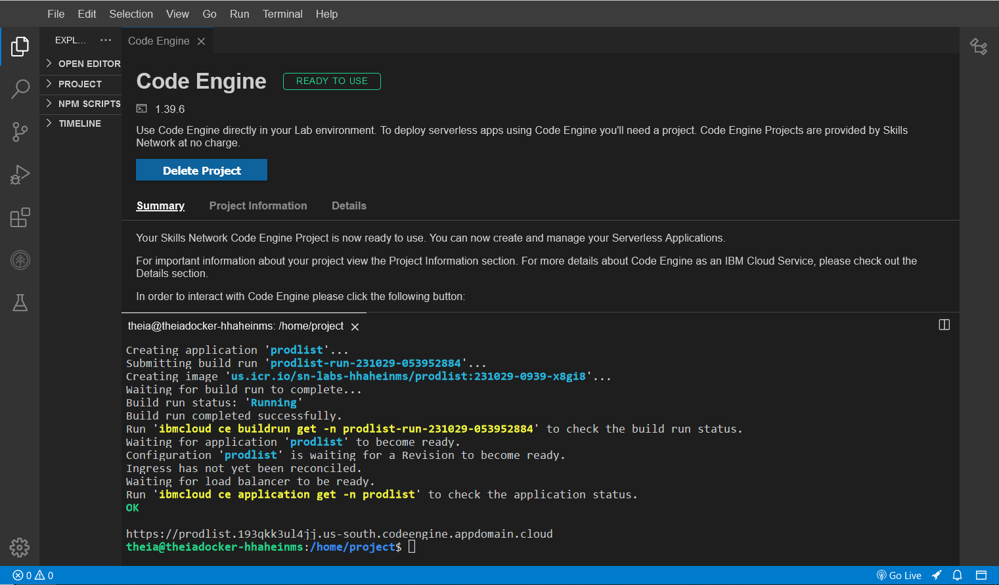
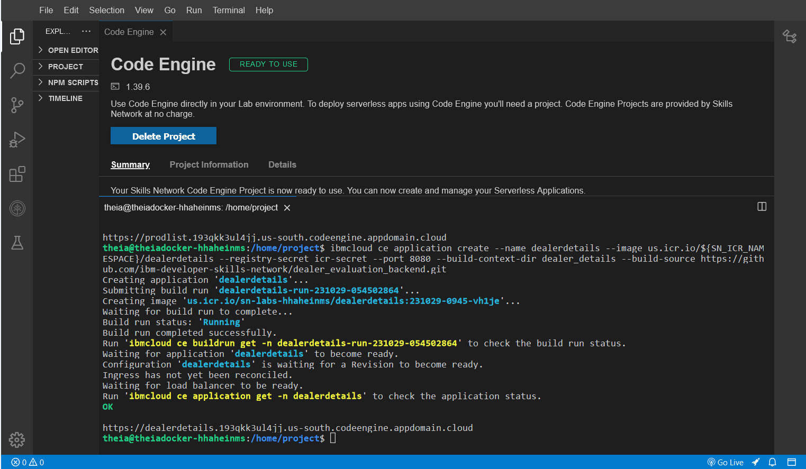
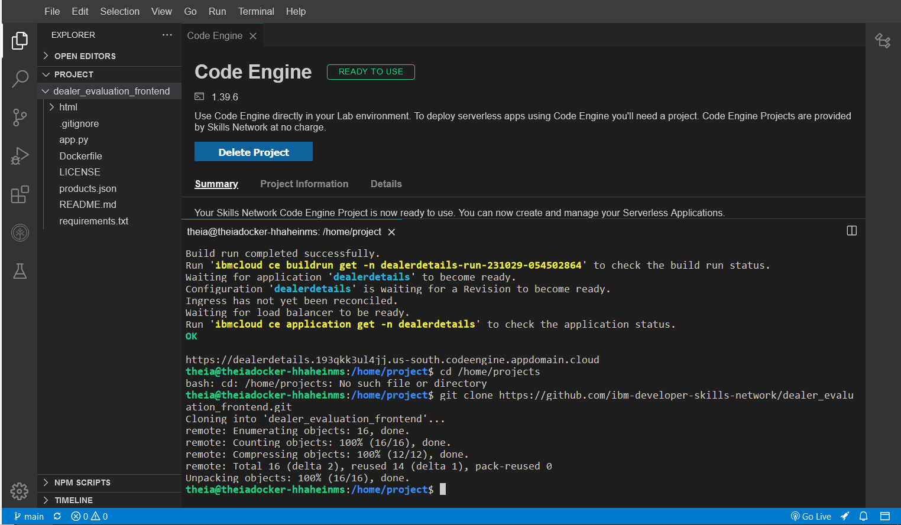
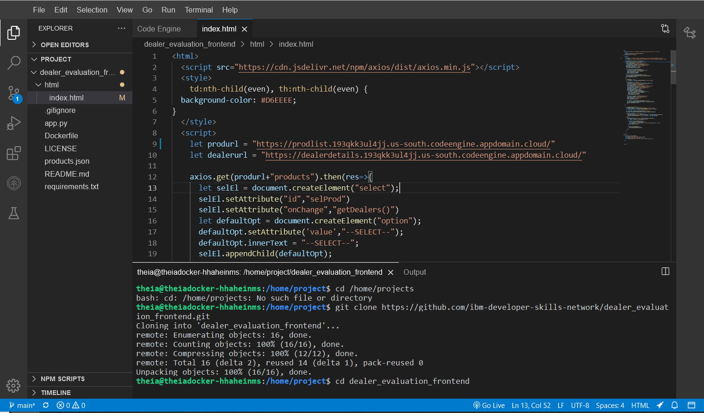
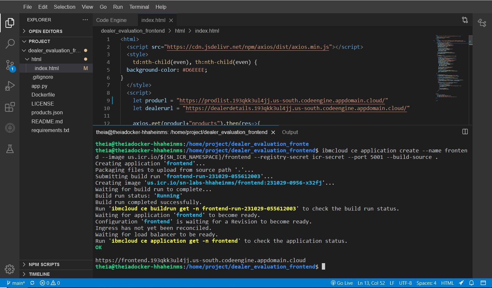
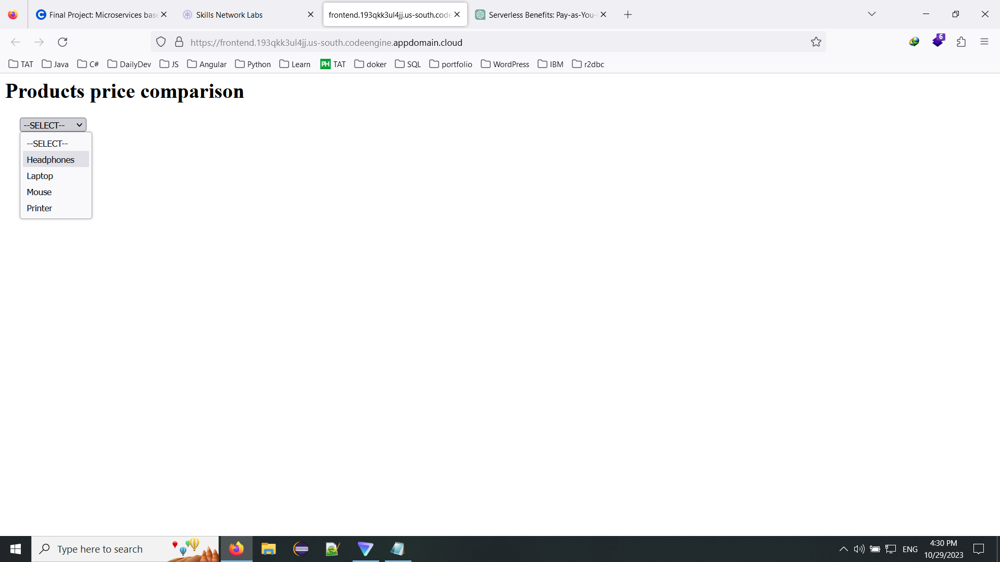
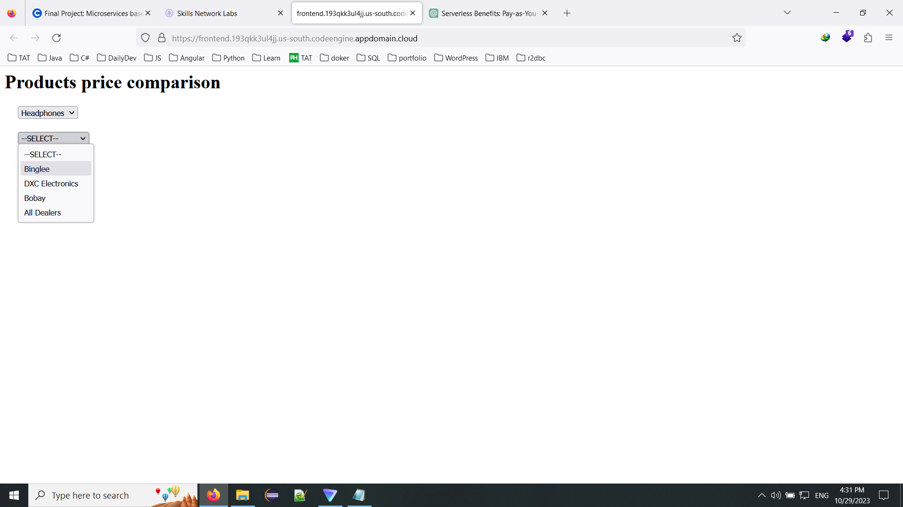
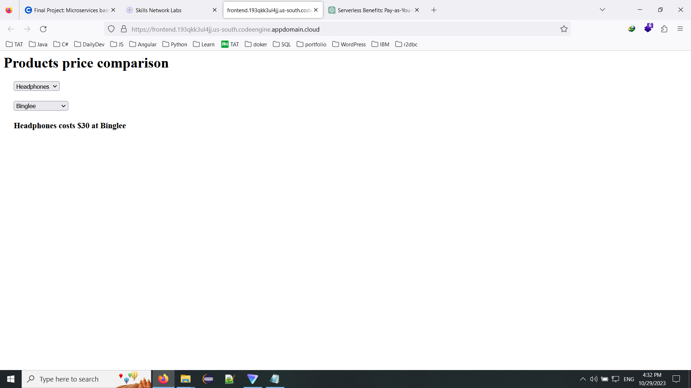
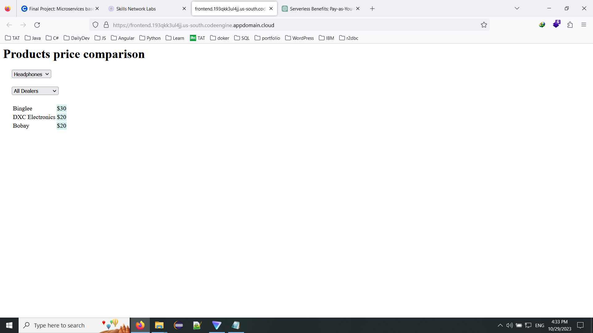

# 🚗 Dealer Evaluation & Product Price Comparison Microservices Platform

[-brightgreen)]()

Final Project submission for **Application Development using Microservices and Serverless** (IBM Full Stack Software Developer Professional Certificate).

---

## 📌 Project Overview

This project consists of deploying an integrated application composed of three distinct microservices using serverless technology on **IBM Cloud Code Engine**:

1. **Product Details Microservice (Python / Flask)**: Provides API endpoints to retrieve catalog products and associated dealers.
2. **Dealer Pricing Microservice (Node.js / Express)**: Provides API endpoints to query price quotes for individual dealers and aggregated comparison tables.
3. **Dealer Evaluation Frontend Microservice (HTML / JavaScript / Axios)**: Interactive frontend consumer consuming the backend microservice endpoints.

---

## 🔗 Deployed Application & Microservice Endpoints

| Microservice | Technology | Port | Deployed Endpoint URL |
| :--- | :--- | :--- | :--- |
| **Product Details Backend** | Python / Flask | 5000 | https://prodlist.193qkk3ul4jj.us-south.codeengine.appdomain.cloud/products |
| **Dealer Pricing Backend** | Node.js / Express | 8080 | https://dealerdetails.193qkk3ul4jj.us-south.codeengine.appdomain.cloud/ |
| **Dealer Evaluation Frontend** | HTML5 / Axios | 5001 | https://frontend.193qkk3ul4jj.us-south.codeengine.appdomain.cloud/ |

---

## 📋 Review Criteria & Deliverables Summary (15 / 15 Points)

| # | Task / Criteria | Points | Screenshot Link |
| :--- | :--- | :---: | :--- |
| **1** | Deploy Microservice for Product Details (Python) on Code Engine | 2 | [View Screenshot](screenshots/1_product_details_deploy.png) |
| **2** | Deploy Microservice for Dealer Pricing (Node.js) on Code Engine | 2 | [View Screenshot](screenshots/2_dealer_details_deploy.png) |
| **3** | Git clone Dealer Evaluation (Frontend) Microservice | 1 | [View Screenshot](screenshots/3_git_clone.png) |
| **4** | Change code to point to API endpoints in index.html | 2 | [View Screenshot](screenshots/4_index_urlchanges.png) |
| **5** | Deploy Dealer Evaluation Frontend on Code Engine | 2 | [View Screenshot](screenshots/5_frontend_deploy.png) |
| **6** | Homepage showing preloaded products in dropdown | 2 | [View Screenshot](screenshots/6_homepage.png) |
| **7** | Product selected from dropdown: dealers listed | 1 | [View Screenshot](screenshots/7_product_dealer.png) |
| **8** | Dealer selected: price displayed | 1 | [View Screenshot](screenshots/8_product_dealer_price.png) |
| **9** | All dealers selected: comparative prices displayed | 2 | [View Screenshot](screenshots/9_product_all_dealers_prices.png) |

---

## 🛠️ Step-by-Step Implementation & Verification

### Task 1: Deploy Microservice for Product Details (Python) (2 Points)
- **Component**: products_list (Python Flask)
- **Source**: https://github.com/ibm-developer-skills-network/dealer_evaluation_backend.git
- **Command**:
  \\\ash
  ibmcloud ce application create --name prodlist \
    --image us.icr.io/${SN_ICR_NAMESPACE}/prodlist \
    --registry-secret icr-secret \
    --port 5000 \
    --build-context-dir products_list \
    --build-source https://github.com/ibm-developer-skills-network/dealer_evaluation_backend.git
  \\\
- **Result URL**: https://prodlist.193qkk3ul4jj.us-south.codeengine.appdomain.cloud
- **Direct Link**: [1_product_details_deploy.png](screenshots/1_product_details_deploy.png)

---

### Task 2: Deploy Microservice for Dealer Pricing (Node.js) (2 Points)
- **Component**: dealer_details (Node.js Express)
- **Source**: https://github.com/ibm-developer-skills-network/dealer_evaluation_backend.git
- **Command**:
  \\\ash
  ibmcloud ce application create --name dealerdetails \
    --image us.icr.io/${SN_ICR_NAMESPACE}/dealerdetails \
    --registry-secret icr-secret \
    --port 8080 \
    --build-context-dir dealer_details \
    --build-source https://github.com/ibm-developer-skills-network/dealer_evaluation_backend.git
  \\\
- **Result URL**: https://dealerdetails.193qkk3ul4jj.us-south.codeengine.appdomain.cloud
- **Direct Link**: [2_dealer_details_deploy.png](screenshots/2_dealer_details_deploy.png)

---

### Task 3: Git Clone the Dealer Evaluation Frontend (1 Point)
- **Repository Cloned**: https://github.com/ibm-developer-skills-network/dealer_evaluation_frontend.git
- **Commands**:
  \\\ash
  cd /home/project
  git clone https://github.com/ibm-developer-skills-network/dealer_evaluation_frontend.git
  cd dealer_evaluation_frontend
  \\\
- **Direct Link**: [3_git_clone.png](screenshots/3_git_clone.png)

---

### Task 4: Configure API Endpoints in index.html (2 Points)
- **Target File**: html/index.html
- **Code Modification**:
  \\\javascript
  // Replace localhost placeholders with deployed Code Engine backend service URLs:
  let produrl = "https://prodlist.193qkk3ul4jj.us-south.codeengine.appdomain.cloud/"
  let dealerurl = "https://dealerdetails.193qkk3ul4jj.us-south.codeengine.appdomain.cloud/"
  \\\
- **Direct Link**: [4_index_urlchanges.png](screenshots/4_index_urlchanges.png)
- **Committed Code**: [html/index.html](html/index.html)

---

### Task 5: Deploy Dealer Evaluation Frontend on Code Engine (2 Points)
- **Command**:
  \\\ash
  ibmcloud ce application create --name frontend \
    --image us.icr.io/${SN_ICR_NAMESPACE}/frontend \
    --registry-secret icr-secret \
    --port 5001 \
    --build-source .
  \\\
- **Result URL**: https://frontend.193qkk3ul4jj.us-south.codeengine.appdomain.cloud
- **Direct Link**: [5_frontend_deploy.png](screenshots/5_frontend_deploy.png)

---

### Task 6: Homepage with Preloaded Products Dropdown (2 Points)
- **Verification**: Loaded the frontend application URL in browser. Axios executes GET /products on the Product Details service, populating the dropdown with products: Headphones, Laptop, Mouse, Printer.
- **Direct Link**: [6_homepage.png](screenshots/6_homepage.png)

---

### Task 7: Product Selected & Dealers Listed (1 Point)
- **Verification**: Selecting a product (e.g., Headphones) invokes GET /getdealers/Headphones, successfully rendering the dealers list dropdown: Binglee, DXC Electronics, Bobay, All Dealers.
- **Direct Link**: [7_product_dealer.png](screenshots/7_product_dealer.png)

---

### Task 8: Dealer Selected & Price Displayed (1 Point)
- **Verification**: Choosing dealer Binglee triggers GET /price/Binglee/Headphones, rendering the formatted offer message: "Headphones costs  at Binglee".
- **Direct Link**: [8_product_dealer_price.png](screenshots/8_product_dealer_price.png)

---

### Task 9: All Dealers Selected & Price Comparison Table Displayed (2 Points)
- **Verification**: Choosing All Dealers invokes GET /allprice/Headphones, building a dynamic HTML comparison table showing prices across all suppliers:
  - **Binglee**: $30
  - **DXC Electronics**: $20
  - **Bobay**: $20
- **Direct Link**: [9_product_all_dealers_prices.png](screenshots/9_product_all_dealers_prices.png)

---

## 🏆 Summary

All microservices have been successfully deployed, integrated via REST endpoints, and verified end-to-end according to the project review criteria.